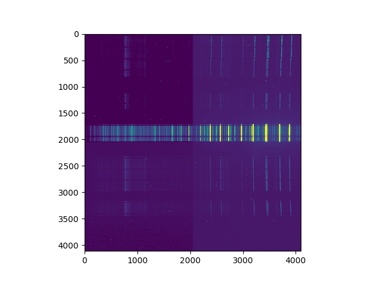
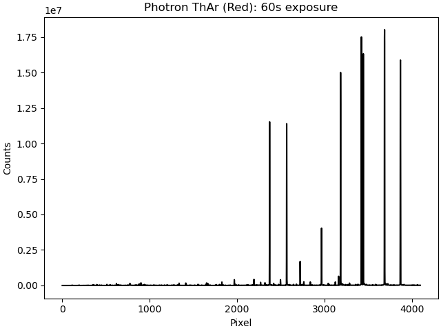
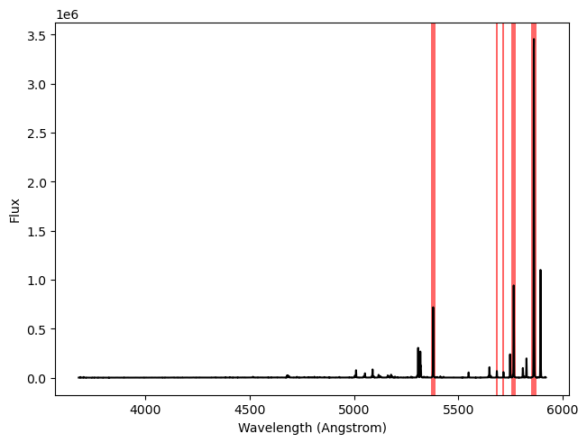

# Homepage

# MAVIS calibration tests using Hector data

This repository contains code which takes some raw exposures of various different Hector calibration lamps and measures their fluxes in ADU/s as a function of wavelength. This will be useful for the MAVIS team.

The analysis steps are:

* Subtract off the dark frames and the bias level and turn the 2D image into a 1D spectrum (`save_1d_spec.py`).
* Get a wavelength calibration for the spectrum.
* Find some bright lines and measure their fluxes by summing across a range of pixels.

A short summary of all of these is below.

## Running this code

If you'd like to run the code, please clone the repo, create a new python environment (with either `conda` or `venv`) and run `pip install .` from the main folder. You'll also need the raw data which I've prepared (by editing some filenames, etc). I've passed this on to Richard McDermid. 

## The analysis steps

### Making 1D spectra

The file `src/scripts/save_1d_spec.py` does the following things:

* Reads the input file.
* Subtracts the bias from the image. If we have a dark frame, this is subtracted. Otherwise, we calculate a bias level using `np.nanmedian(image)`. There's a check to make sure that this value isn't huge or tiny, but this really isn't very accurate. Be careful about using the files which don't have dark exposures!
* Gets the exposure time and the arc lamp name from the filename.
* Sums the image along the spatial dimension `(axis=0)` to go from 2D to 1D.
* Saves a plot of this spectrum for QC.
* Saves a 1D fits file with appropriate header keywords.

The raw input images look like this:

Note that there looks to be a bias difference on each half of the detector: it's roughly 500 counts on the left and 504 on the right. This is currently ignored in the analysis when we don't have a dark frame. 

We then collapse them down into a 1D spectrum, which looks like this:

### Getting a wavelength calibration

I'm assuming that the wavelength calibration for this data is roughly the same as previously reduced Hector data, so I'm using the same calibration as there. This is probably only good to a few Angstroms or so (2-5 pixels).

Looking at a handful of previously reduced arc frames, their wavelength solutions are below. For the blue:

| CRVAL      | CRPIX        | CDELT |
| :----------- | :----------- | :------ |
| 0.542... | 2048 | 4837.4... |
| 0.547... | 2048 | 4799.7... |
| 0.547... | 2048 | 4799.7... |
| 0.547... | 2048 | 4799.7... |
| 0.542... | 2048 | 4837.4... |
| 0.547... | 2048 | 4799.7... |
| 0.547... | 2048 | 4799.7... |

and for the red:

| CRVAL      | CRPIX        | CDELT |
| ----------- | ----------- | ------ |
| 0.520... |  2048 | 6754.7... |
| 0.518... |  2048 | 6781.9... |
| 0.518... |  2048 | 6781.9... |
| 0.520... |  2048 | 6754.7... |
| 0.520... |  2048 | 6754.7... |
| 0.520... |  2048 | 6754.7... |
| 0.520... |  2048 | 6754.7... |
| 0.520... |  2048 | 6754.7... |
| 0.520... |  2048 | 6754.7... |
| 0.520... |  2048 | 6754.7... |

I'm therefore going to take the most common wavelength solution here: (0.5470085470085, 2048, 4799.726495726) for the blue and (0.5201465201465, 2048, 6754.73992674) for the red.

### Summing the emission lines to measure fluxes

The file `measure_line_fluxes.py` does the following things:

* Reads in a `.csv` file which has the line definitions (start, stop in pixels)
* Sums the flux between these wavelengths
* Calculates the number of ADUs per second by dividing by the exposure time and the number of fibres in a Hexabundle (which is 61).
* Saves the table with all these measurements in.
* Saves a QC plot of where the line definitions are in the spectrum, an example of which is shown below.

The final tables are saved in `src/data/results` as a `.csv` file. The columns are "pixel", which gives the central pixel of the line, "Wavelength", which gives the central wavelength of the line, and "Flux", which is the number of ADUs per second measured for that line.